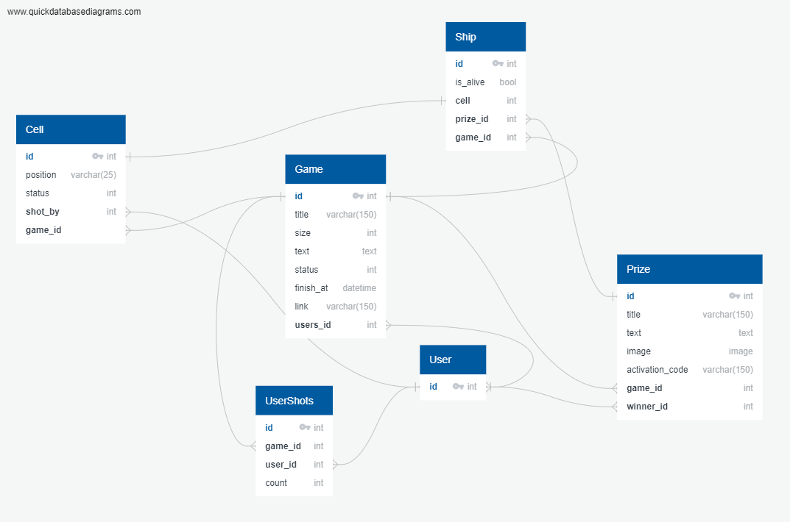

## <p align=center>МОСКОВСКАЯ ПРЕДПРОФЕССИОНАЛЬНАЯ ОЛИМПИАДА ШКОЛЬНИКОВ 2023/2024</p>


### Профиль «Информационные технологии» 🐱‍💻<br><br> Командный кейс № 6 «Sea Battle: Разработка Web-игры по принципу морского боя для розыгрыша призов» 🚢
---

### Описание проекта ℹ
TODO  
Проект состоит из двух частей: клиентской части на ReactJS и серверной части на Django и Django REST Framework (DFR).

### Запуск серверной части (Django + DFR):

# Установка 
## Клонирование репозитория
```
git clone https://github.com/N1qro/sea-battle-with-gifts.git
```
## Создание виртуального окружения
### Для Linux
```
python3 -m venv venv
source venv/bin/activate
```
### Для Windows
```
python -m venv venv
venv\bin\activate
```

## Перейдите в директорию backend
```
cd backend
```

## Установка .env
### Для Linux
```
mv template.env .env
```
И измените .env под себя
### Для Windows
```
ren template.env .env
```
И измените .env под себя

## Установка requirements
### Выберите один из файлов
Для работы сайта:
```
pip install -r requirements/prod.txt
```
Для разработки:
```
pip install -r requirements/dev.txt
```
Для тестирования и отладки:
```
pip install -r requirements/test.txt
```

## Перейдите в директорию sea_battle
```
cd sea_battle
```

## Подготовка проекта
```
python manage.py migrate
```

## Запуск проекта
```
python manage.py runserver
```

## База данных



### Запуск клиентской части (ReactJS):

1. Перейдите в каталог клиента, используя команду `cd frontend` в командной строке.
2. Установите все необходимые зависимости с помощью команды `npm install`.
3. Запустите сервер разработки ReactJS с помощью команды `npm run dev`.

Пожалуйста, убедитесь, что у вас установлены все необходимые инструменты, включая **Node.js** и **Python**, перед тем как запустить эти команды.
Для стабильной работы сайта, убедитесь что у вас запущен как сервер клиентской части, так и бэкенд сервер.

---

### Участники 👨‍💻
* Матвей (@GormCHEV)
* Новиков Андрей Юрьевич (https://github.com/n1qro)
* Данилов Андрей Юрьевич (https://github.com/DRAKUTONT)
* Кляйн Михаил Андреевич (https://github.com/mk5606)

> Техническая документация требуемого проекта: https://cloud.predprof.olimpiada.ru/index.php/s/cSbWxGQ3PsW5z7E  
> Просмотр выданных задач на Clickup: https://sharing.clickup.com/9015251148/l/h/6-901501728434-1/b4dfd23e2fc3632v
